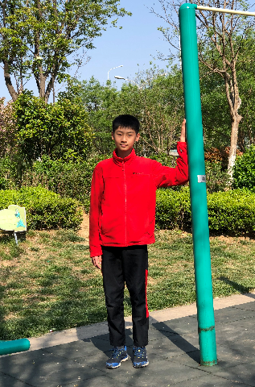

## 个人肖像使用授权协议书
### 根据《中华人民共和国广告法》和《中华人民共和国民法典》的有关规定，为明确肖像使用方和授权方的义务、权利关系，您同意以下协议：
一、甲方为肖像权人，自愿将自己的肖像（见附件）无偿授予您使用。 
二、您使用照片的**形式不限**，可以合法用于**商业用途和/或个人使用**，并允许对照片进行**适度、不损害甲方名誉权**的改动和加工，甲方**不得**加以限制和要求报酬。 
三、肖像使用期限自2022年7月20日起至2023年1月1日，授权地域为中华人民共和国国内和国外范围。 
四、肖像在使用期间，肖像使用方需要将肖像用于其他媒体上时，**无须**事先取得肖像授权方的同意。 
五、本协议书生效后，您即受本协议条款的约束，对其任何条款或承诺的违反均构成违约，应承担违约责任，并赔偿损失，支付违约费用。 
六、您因本协议发生争议，向济南市市中区人民法院提起诉讼。 
肖像方：**孙福翔** 
日期：**2022/7/18** 
### 附件

